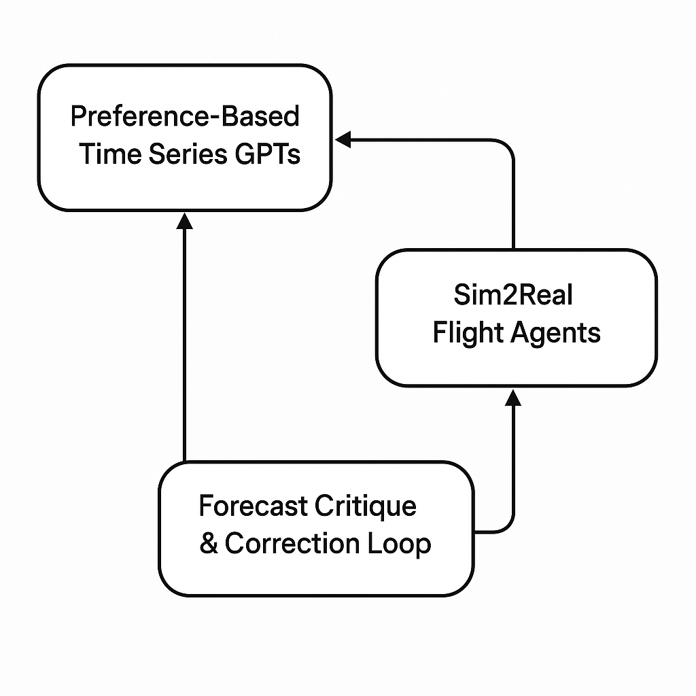

# 🛠️ Project Tracker

* activity tracker

---

## 🗓️ Weekly Schedule

| Day       | Focus Area             | Activity |
|-----------|------------------------|----------|
| Tuesday   | 🖨️ 3D Printer Projects | Print a telescope or Antikythera part |
| Wednesday | 📻 Radio Kit           | Solder/test for 20 minutes |
| Thursday  | ✈️ RC Plane            | Work on electronics / practice sim |
| Saturday  | 🤖 LLM Robot for Daughter | Boot Orin Nano / run basic code |
| Sunday    | 🧠 Reflection + Reading | Zeloof blog + prep tasks for next week |

---

## 🗓️ Monthly Calendar Template

| Week      | Focus Project          | Add-on Task |
|-----------|------------------------|-------------|
| Week 1    | Finish Prusa build     | 3D print working telescope base |
| Week 2    | Radio kit assembly     | Film soldering time-lapse |
| Week 3    | RC plane first flight  | Watch ornithopter videos |
| Week 4    | LLM Robot setup        | Try local speech-to-text demo |

---

## 🧠 Monthly Rotation Plan

| Category               | Item                           | Cycle |
|------------------------|--------------------------------|--------|
| Quick Wins             | Radio kits, solder, test       | Weekly |
| Hardware + Tools       | Prusa, RC plane, ornithopter   | Monthly |
| Long Builds            | LLM bot, 6502, chip research   | Rotating |

---

## 📆 Example Monthly Calendar (June–July 2025)

### Week 1
- ✅ Finish assembling Prusa 3D printer
- 🖨️ Print telescope part
- 🧠 Read Zeloof blog on photolithography

### Week 2
- 📻 Complete radio kit #1
- 🧠 Plan robot parts for Orin Nano bot

### Week 3
- ✈️ RC plane: complete electronics
- 🕹️ Run RC flight sim
- 🦋 Watch 1 ornithopter flight video

### Week 4
- 🤖 LLM buddy bot: audio I/O working
- 💬 Run basic chatbot API
- 🧠 Start first 6502 kit steps (if time)

---

## ✅ Done Log (Sample)

| Date       | Task Completed                     | Notes |
|------------|------------------------------------|-------|
| June 29    | Printed telescope gear             | Looks smooth, reprint with tighter tolerances ||
| June 26    | Soldered half the radio kit        | Ready for power test |

---

# AI Research Portfolio 

Research projects, grounded in real systems (blast furnace, energy data, RC flight), and infused with cutting-edge AI methods (preference learning, latent modeling, self-critique, and autonomous control).

---

## 🥇 Project 1: Preference-Based Time Series GPTs

**Theme**: Fine-tune GPT-style models for time series forecasting using preference-based methods instead of traditional supervision.

### Key Concepts

* **DPO** (Direct Preference Optimization)
* **GRPO** (Gradient Reward Preference Optimization)
* **SPO** (Score-based Preference Optimization – proposed)
* Preference signals from score metrics (R^2, RMSE) or human annotations

### Applications

* Blast furnace silicon prediction
* UCI Appliances Energy dataset

### Inspirations

* *“Direct Preference Optimization: Your Language Model is Secretly a Reward Model”* by Rafailov et al. (2023)
  [arXiv:2305.18290](https://arxiv.org/abs/2305.18290)

* *"DeepSeek Math"
  https://arxiv.org/abs/2402.03300

* *“RLHF: Reinforcement Learning with Human Feedback”* (OpenAI summary + implementation base)
  [https://huggingface.co/blog/rlhf](https://huggingface.co/blog/rlhf)

### Goals

* Replace labeled regression losses with preference-based loops
* Fine-tune GPTs with human or score-derived preferences
* Extend to self-refining loops with critic models (see Project 3)

---

## 🛫 Project 2: Sim2Real Flight Agents for Autonomous Control

**Theme**: Extend prior RL-based autopilot research using simulation (X-Plane 11) into modern, preference-aware agents deployable to physical RC aircraft.

### Key Concepts

* Simulation-to-reality transfer (Sim2Real)
* Curriculum learning + preference signals
* GameNGen-style evaluation environments

### Hardware + Simulation

* X-Plane 11 (used in prior publications)
* RC planes with onboard electronics

## Code

* https://github.com/rcalix1/Deep-learning-ML-and-tensorflow/tree/master/ReinforcementLearning/DeepQAP/DeepQAP2.0
* link

### Inspirations

* *“Dreamer: Scalable Reinforcement Learning with World Models”* by Hafner et al. (2020) https://research.google/blog/introducing-dreamer-scalable-reinforcement-learning-using-world-models/ 
  [arXiv:1912.01603](https://arxiv.org/abs/1912.01603)

* *GameNGen: General Game Engine for Curriculum RL Training* ([https://gamengen.github.io](https://gamengen.github.io))

* *“Curriculum Learning”* by Bengio et al. (2009)
  https://dl.acm.org/doi/10.1145/1553374.1553380

* *"CHM MAKES ALEXNET SOURCE CODE AVAILABLE TO THE PUBLIC"
https://computerhistory.org/press-releases/chm-makes-alexnet-source-code-available-to-the-public/

* *"Stable Diffusion Examples"
https://github.com/rcalix1/LatentDiffusion/tree/main

* *"Kestrel"
https://github.com/rcalix1/robotics/tree/main/ornithopters/hardware/kestrel
  
### Goals

* Rebuild flight agents in Gym-like environment
* Incorporate preference scores or critiques for flight behaviors
* Transfer to RC hardware with modular policy design

---

## 🤖 Project 3: Forecast Critique and Correction Loop

**Theme**: Pair a forecasting GPT with a learned Critic that scores the forecast’s quality (e.g., plausibility, expected RMSE), enabling revision and self-correction.

### Key Concepts

* Self-rating and self-improving models
* Critic model trained from score metrics
* Optional forecast refinement step

### Inspirations

* *“Self-Refine: Iterative Refinement with Self-Feedback”* by Madaan et al. (2023)
  [arXiv:2303.17651](https://arxiv.org/abs/2303.17651)

* *“Chain-of-Verification Reduces Hallucination in Large Language Models", Shehzaad Dhuliawala, Mojtaba Komeili, Jing Xu, Roberta Raileanu, Xian Li, Asli Celikyilmaz, Jason Weston
(https://arxiv.org/abs/2309.11495)

* *“RLAIF: Reinforcement Learning from AI Feedback”* by Bai et al. (Anthropic, 2023)
  [[arXiv:2307.15217](https://arxiv.org/abs/2307.15217)](https://cameronrwolfe.substack.com/p/rlaif-reinforcement-learning-from)

* *"Unexpectedness as a Measure of Semantic Learning"
https://github.com/rcalix1/music/blob/main/activities/IJAITsemanticUnexpectednessTransformer.pdf

* *"QWEN from scratch"
https://github.com/rasbt/LLMs-from-scratch/tree/main/ch05/11_qwen3

### Goals

* Create a GPT-based forecasting system with feedback loop
* Train a Critic model to evaluate or flag poor forecasts
* Enable auto-revision or ranking of outputs

---

## 🌀 Project 4: Entanglement Radio and the Pillar – Modular Field Sensing with AI/ML Integration

**Theme**: Explore speculative and experimental sensing/communication hardware—anchored in the design of *The Pillar*, a modular DIY field synthesis platform—integrated with AI/ML for signal interpretation, anomaly detection, and potential emergent behaviors. This project spans experimental physics and frontier AI.

---

### 🔑 Key Concepts

- Modular emitter/receiver architecture (EM, acoustic, optical, entangled photon channels)
- AI-assisted signal decoding, pattern discovery, and preference learning
- Speculative communication: entangled spectrum hypothesis
- Interpretability of anomalous sensor data through LLMs and critics

---

### 🧪 Hardware + Experimentation

- **The Pillar**: Central GPU-enabled platform with modular plug-in sensors/emitters
- **Subsystems**:
  - Entangled photon module (DIY SPDC-based Bell test rig)
  - EM and acoustic field generator arrays
  - Resonant coil antennas and signal amplifiers
  - Nvidia Orin Nano or Jetson Xavier for onboard inference
- Designed for partially DIY construction and at-home research environments

---

### 📚 Inspirations

- *Self-Supervised Learning with Physics Priors* (general framework)
- *Detecting Unknown Signals with Transformers* – anomaly detection literature
- Veritasium’s Bell Test video + Hackaday.io entanglement projects
- *Chain-of-Critique* (or Forecast Critique Loops) for autonomous refinement
- GitHub repo: [The Pillar on DIYphysics](https://github.com/rcalix1/DIYphysics/tree/main/FringeDIYprojects)
- https://github.com/rcalix1/DIYphysics/blob/main/FringeDIYprojects/entanglement.md
- https://github.com/rcalix1/DIYphysics/blob/main/FringeDIYprojects/entanglementRadio.md
- https://github.com/rcalix1/DIYphysics/blob/main/FringeDIYprojects/fieldSynthesizer.md

---

### 🎯 Goals

- Construct and deploy a modular sensing/communication stack
- Use ML models (e.g., time-series GPT, critics) to:
  - Classify ambient/mixed signals
  - Rank unexpected patterns using preference models
  - Trigger adaptive field behavior or signal alignment
- Evaluate speculative ideas such as communication via entangled states
- Bridge DIY physics experimentation with generative AI interpretation loops

---

> This project is intentionally at the frontier of plausible science and creative engineering. The goal is to blur the line between what AI can *observe*, *reframe*, or *discover* when immersed in rich, ambiguous signal environments.

